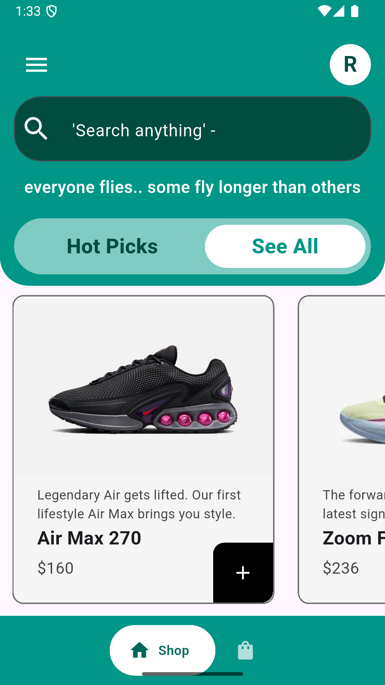

# 👟 Sneaker E-Commerce App

## Overview

A full-stack Flutter e-commerce application specializing in sneaker sales. This application demonstrates advanced mobile development practices with real-time Firestore synchronisation, Firebase authentication with guest-to-permanent account linking, and complex state management using Provider + ChangeNotifier. The app handles both guest users and registered customers with seamless data preservation and a fully responsive UI.

---

## ✨ Key Features

* Firebase Authentication — Email/password signup with secure authentication
* Guest User Support — Browse and add items to your cart as a guest with automatic data preservation
* Account Linking — Seamlessly convert guest accounts to permanent accounts without losing your active cart data
* Cloud Cart Sync — Cart updates instantly and syncs to Cloud Firestore using array union operations
* Responsive UI — Fluid scaling and layout adaptation that works perfectly on all Android and iOS device sizes
* State Management — Robust implementation of Provider and ChangeNotifier to handle shop inventory and user carts

---
## 📸 Screenshots


<p align="center">
  
  &nbsp;&nbsp;&nbsp;
  
  &nbsp;&nbsp;&nbsp;
  
</p>

<p align="center">
  
  &nbsp;&nbsp;&nbsp;
  
  &nbsp;&nbsp;&nbsp;
  
</p>

<p align="center">
  
  &nbsp;&nbsp;&nbsp;
  
  &nbsp;&nbsp;&nbsp;
  
</p>

<p align="center">
  
</p>

(Add your screenshots to the `screenshots/` folder and they will appear here)

---

## 🛠 Tech Stack

| Layer              | Technology                                |
| ------------------ | ----------------------------------------- |
| Frontend Framework | Flutter 3.0+                              |
| Language           | Dart 3.0+                                 |
| State Management   | Provider (ChangeNotifier)                 |
| Backend            | Firebase (Auth + Cloud Firestore)         |
| Architecture       | Feature-First / Service Pattern           |
| UI Components      | Google Nav Bar, Custom Responsive Widgets |

---

## 🏗 Architecture

```
lib/
├── features/
│   ├── cart/
│   │   └── providers/
│   │       ├── auth_provider.dart
│   │       └── cart_provider.dart
│   ├── shop/
│   │   ├── models/
│   │   │   └── shoe_model.dart
│   │   ├── pages/
│   │   │   ├── auth_gate.dart
│   │   │   ├── home_page.dart
│   │   │   ├── shop_page.dart
│   │   │   └── detail_page.dart
│   │   ├── services/
│   │   │   ├── firbase_auth.dart
│   │   │   └── firestore_services.dart
│   │   └── widgets/
│   │       └── shoe_tile.dart
└── core/
    └── widgets/
        └── my_textfield.dart
```

---

## 🚀 Implementation Highlights

### 1. Guest to User Account Linking (No Data Loss)

**Problem:**
A guest adds items to their cart, decides to purchase, but loses their cart data when forced to create a new account.

**Solution:** Firebase Anonymous Auth + Credential Linking

```dart
await FirebaseAuth.instance.signInAnonymously();

final credential = EmailAuthProvider.credential(
    email: email,
    password: password,
);

await FirebaseAuth.instance.currentUser?.linkWithCredential(credential);
```

---

### 2. Cloud-Synced Cart State Management

**Problem:**
Need instant UI updates while syncing with Firestore.

**Solution:** ChangeNotifier + Firestore sync

```dart
Future<void> addItemToCart(Shoe shoe) async {
  userCart.add(shoe);
  notifyListeners();

  final User? currentUser = FirebaseAuth.instance.currentUser;
  if (currentUser != null) {
    await FirebaseFirestore.instance
        .collection('users')
        .doc(currentUser.uid)
        .update({
      'cart': FieldValue.arrayUnion([shoe.toMap()]),
    });
  }
}
```

---

### 3. Responsive UI with Fluid Scaling

```dart
final size = MediaQuery.sizeOf(context);
final double screenWidth = size.width;

Container(
  width: screenWidth * 0.7,
  padding: EdgeInsets.all(screenWidth * 0.05),
)
```

---

## 📊 Firestore Data Structure

### Users Collection

```
/users/{uid}
    ├── email: "user@example.com"
    ├── userName: "John Doe"
    └── cart: [
          {
            "name": "Air Jordan",
            "price": "220",
            "imagePath": "assets/images/jordan.png"
          }
        ]
```

---

### Products Collection

```
/products/{productId}
    ├── name: "Nike Air Max"
    ├── price: "160"
    ├── description: "..."
    ├── isBestSeller: true
    └── imagePath: "assets/images/airmax.png"
```

---

## 🎯 How to Run

### Clone the repository

```bash
git clone https://github.com/YourUsername/Sneaker-Vault-App.git
cd Sneaker-Vault-App
```

### Install dependencies

```bash
flutter pub get
```

### Setup Firebase

* Create a Firebase project
* Enable Authentication (Anonymous + Email/Password)
* Enable Firestore Database
* Add `google-services.json` (Android) and `GoogleService-Info.plist` (iOS)

### Run the app

```bash
flutter run
```

---

## 🎓 Learning Outcomes

* Firebase Authentication (Anonymous + Email linking)
* Firestore array operations (`arrayUnion`, `arrayRemove`)
* Provider + ChangeNotifier state management
* Responsive UI using MediaQuery
* Null Safety & error handling

---
