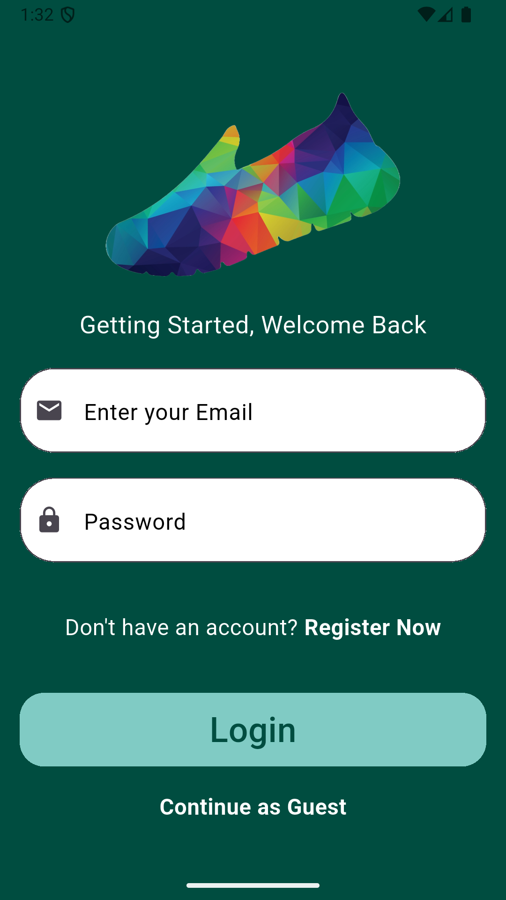
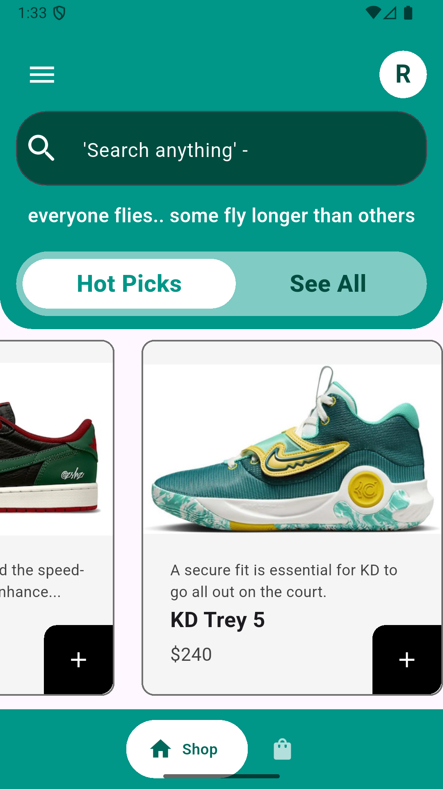
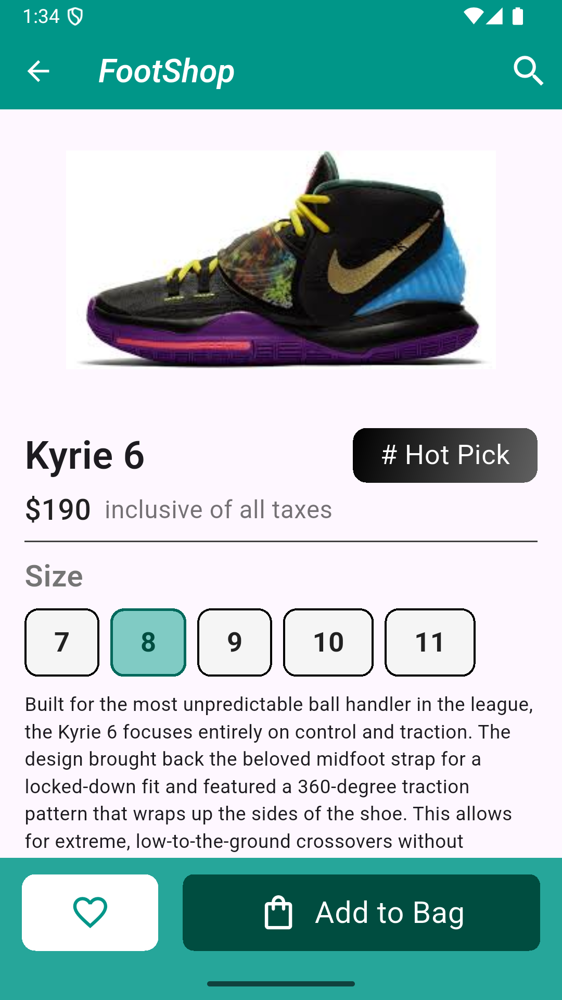
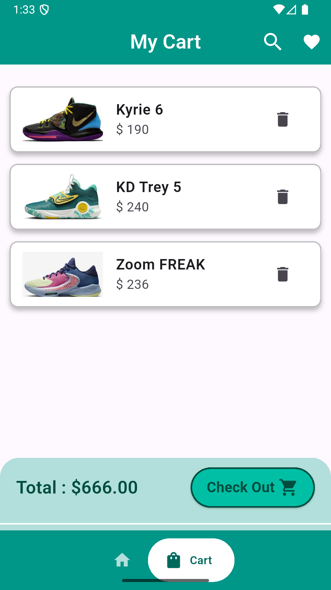

# 👟 Sneaker E-Commerce App

## Overview

A full-stack Flutter e-commerce application specializing in sneaker sales. This application demonstrates advanced mobile development practices with real-time Firestore synchronisation, Firebase authentication with guest-to-permanent account linking, and complex state management using Provider + ChangeNotifier. The app handles both guest users and registered customers with seamless data preservation and a fully responsive UI.

---

## ✨ Key Features

* Firebase Authentication — Email/password signup with secure authentication
* Guest User Support — Browse and add items to your cart as a guest with automatic data preservation
* Account Linking — Seamlessly convert guest accounts to permanent accounts without losing your active cart data
* Cloud Cart Sync — Cart updates instantly and syncs to Cloud Firestore using array union operations
* Responsive UI — Fluid scaling and layout adaptation that works perfectly on all Android and iOS device sizes
* State Management — Robust implementation of Provider and ChangeNotifier to handle shop inventory and user carts

---
## 📸 Screenshots

  
  &nbsp;&nbsp;&nbsp;
  
  &nbsp;&nbsp;&nbsp;
  

  
  &nbsp;&nbsp;&nbsp;
  
  &nbsp;&nbsp;&nbsp;
  

---

## 🛠 Tech Stack

| Layer              | Technology                                |
| ------------------ | ----------------------------------------- |
| Frontend Framework | Flutter 3.0+                              |
| Language           | Dart 3.0+                                 |
| State Management   | Provider (ChangeNotifier)                 |
| Backend            | Firebase (Auth + Cloud Firestore)         |
| Architecture       | Feature-First / Service Pattern           |
| UI Components      | Google Nav Bar, Custom Responsive Widgets |

---
